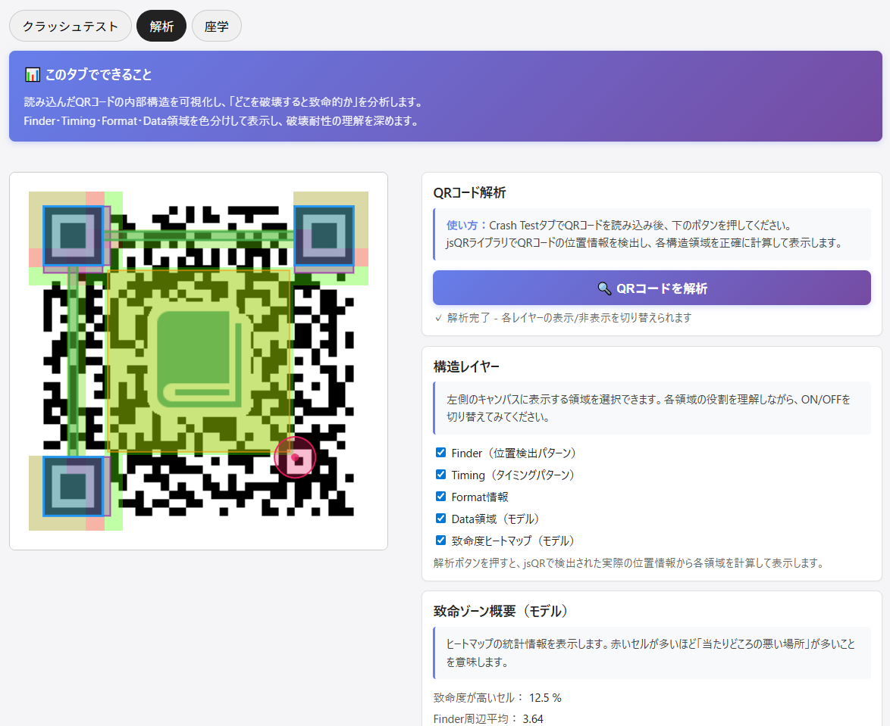

<!--
---
id: day102
slug: qrcrashtest

title: "QRCrashTest"

subtitle_ja: "QRコード耐性テストツール"
subtitle_en: "QR code crash-test visualization tool"

description_ja: "影・汚れ・欠損などのダメージに対するQRコードの読み取り耐性を体験できる実験ツール。構造レイヤーと致命ゾーンの可視化により、誤り訂正と“当たりどころ”の違いを直感的に学べる。"
description_en: "Interactive crash-test lab for QR codes — simulate shadows, occlusion, dirt, and damage to visualize how QR structure and error correction affect scan survivability."

category:
  - qr
  - visualization
  - security
  - educational

difficulty: 3

tags:
  - qr
  - qr-code
  - visualization
  - image
  - error-correction
  - education
  - javascript

repo_url: "https://github.com/ipusiron/qrcrashtest"
demo_url: "https://ipusiron.github.io/qrcrashtest/"

hub: true
---
!-->

# QRCrashTest – QRコード耐性テストツール


[](https://ipusiron.github.io/qrcrashtest/)

**Day102 - 生成AIで作るセキュリティツール200**

**QRCrashTest** は、QRコード画像に影・汚れ・欠損・ステッカーなどのダメージを与えたとき、どこまで読み取り可能かを体験的に理解するための **QRクラッシュテストツール** です。

- Finder（位置検出パターン）を少し潰しただけで破壊されるのか
- Data領域に汚れが散発しても案外読めてしまうのか
- 影の形や位置で、読み取り結果がどう変わるのか

といった当たりどころの悪さを、ブラウザー上でインタラクティブに観察できます。

---

## 🌐 デモページ

👉 **[https://ipusiron.github.io/qrcrashtest/](https://ipusiron.github.io/qrcrashtest/)**

ブラウザーで直接お試しいただけます。

---

## 📸 スクリーンショット

>
>*クラッシュテスト*
>
>
>*QRコードの解析*

---

## 🎯 想定ユースケース

- セキュリティ講義・ワークショップでの **「QRコードの構造と誤り訂正」体験デモ**
- 印刷物・ステッカー・掲示物としてのQRコードの **物理的な弱点の可視化**
- 「影がかかっても読める？」といった **現場感覚の検証用サンドボックス**

---

## ✨ 機能一覧

- 画像ファイル（PNG/JPGなど）の **QRコード読み込み**
  - ファイル選択ダイアログ
  - ドラッグ＆ドロップ対応
  - サンプルQRコード選択（プリセット）
- キャンバス上でのダメージ描画
  - ペン（落書き）
  - 汚れブラシ（Dust）
  - 影ツール（楕円グラデーション）
  - ステッカー（白／黒マスク）
  - ノイズバースト
- **攻撃シナリオプリセット**
  - Finder破壊、Data破壊、全方位攻撃、散発汚れの4種類
  - ワンクリックで特定領域にランダムダメージを追加
- ダメージを加えた状態での **リアルタイム読み取りテスト**
  - SUCCESS / FAIL の判定
  - 復号データの表示
  - 破損率（ダメージピクセル割合）の概算表示
  - ダメージヒートマップ表示（ツールチップ付き）
- **構造レイヤーの可視化（教育用モデル）**
  - Finder / Timing / Format / Data 領域の色分け表示
  - 致命度ヒートマップ（「当たりどころ」モデル）
  - 各レイヤーのON/OFF切り替え（ツールチップで役割説明）
- QRコード構造と誤り訂正の **座学タブ**

---

## 📐 画面構成（3タブ構成）

### 1. 「クラッシュテスト」タブ

QRコードを読み込み、キャンバス上で破壊していく **実験用タブ** です。

- 左側：QRキャンバス
  - 読み込んだQRコード画像を正方形キャンバスにリサイズ表示
  - 上にダメージ用のオーバーレイレイヤーを重ねて描画
- 右側：操作パネル
  - **QRコード読み込み**
    - ファイル選択ダイアログ
    - ドラッグ＆ドロップゾーン（QRキャンバス領域）
    - サンプルQRコード選択（3種類のプリセット）
  - **ダメージツール選択**
    - ペン（太さ調整可）
    - 汚れブラシ（密度調整可）
    - 影（楕円の範囲＋濃さ）
    - ステッカー（矩形サイズ＋白／黒）
    - ノイズバースト（密度調整可）
  - **ダメージヒートマップ表示**
    - チェックボックスでON/OFF切り替え
    - ツールチップ（？アイコン）で機能説明を表示
  - **「ダメージをリセット」ボタン**
  - **攻撃シナリオプリセット**
    - Finder破壊（位置検出パターンを狙う）
    - Data破壊（データ領域を狙う）
    - 全方位攻撃（広範囲にダメージ）
    - 散発汚れ（ランダムな汚れ）
  - **読み取り結果パネル**
    - 状態：SUCCESS / FAIL / 未読込
    - 破損率（ダメージピクセル割合の概算）
    - ECCレベル（本ツールでは「不明」として表示）
    - バージョン（jsQRが返す値を表示）
    - 復号データ（URLなどのテキスト）

描画操作のたびに、**「元のQR＋ダメージレイヤー」を合成した画像に対してjsQRでデコード** をかけ、読み取り結果をリアルタイム表示します。

---

### 2. 「解析」タブ

Crash Testタブで読み込んだ **無傷状態のQR画像** を対象に、
内部構造と「当たりどころの悪さ」をモデル化して表示する **構造解析タブ** です。

- **上部：このタブでできること（説明セクション）**
  - タブの目的と使い方を簡潔に説明
  - Finder・Timing・Format・Data領域の可視化について解説
- **左側：構造解析ビュー**
  - 元のQR画像を再描画
  - その上に、以下のレイヤーを半透明で重ねて表示
    - Finder（位置検出パターン）
    - Timing（タイミングパターン）
    - Format情報
    - Data領域（モデル）
    - 致命度ヒートマップ
- **右側：解析パネル**
  - **QRコード解析**
    - 使い方の説明（各パネルに説明ボックス付き）
    - 「🔍 QRコードを解析」ボタン
    - jsQRライブラリで位置情報を検出し、各構造領域を計算
  - **構造レイヤー**
    - レイヤーのON/OFF切り替え
    - 各チェックボックスにツールチップ（title属性）で役割説明
      - Finder（位置検出パターン）
      - Timing（タイミングパターン）
      - Format情報
      - Data領域（モデル）
      - 致命度ヒートマップ（モデル）
  - **致命ゾーン概要（モデル）**
    - 統計情報の説明ボックス付き
    - 致命度が高いセル割合
    - Finder周辺の平均スコア
    - Data領域の平均スコア

内部的には、QRコード全体を20×20グリッドに分割し、Finder / Timing / Format / Dataとの重なりに応じて **致命度スコア** を付与しています。

> ※ここでのヒートマップは、実際のQR仕様を厳密に再現したものではなく、教育用途向けに簡略化した当たりどころモデルです。

---

### 3. 「座学」タブ

QRCrashTestの実験結果を読み解くための **座学タブ** です。

- QRコード構造の概要
  - Finder / Timing / Format / Data それぞれの役割
- 誤り訂正（ECC）レベルの概要
  - L / M / Q / H の一般的なイメージ
  - 「高いECCほど強いが、そのぶんデータ量が減る」トレードオフ
- 本ツールで確認できるポイント
  - Finder付近の小さなダメージが致命傷になりやすいこと
  - Data領域に散発的な汚れがあっても意外と読めること
  - 影やかすれの形状・位置によって致命度が変わること
- 関連ツール（ImageDiffSec / QR Risk Radar）との位置づけの違い

**「タブ1・タブ2で体験したこと」を理論側から補完する役割** を持たせています。

---

## 📖 使い方

1. **Crash Test タブを開く**
2. **QRコード画像を読み込む**
   - **方法1：** 「QRコード読み込み」ボタンからファイルを選択
   - **方法2：** ドラッグ＆ドロップゾーンに画像をドロップ
   - **方法3：** サンプルQRコードのドロップダウンから選択
3. **ダメージを与える**
   - ダメージツール（ペン・汚れブラシ・影・ステッカー・ノイズ）を選択
   - キャンバス上でクリック/ドラッグして描画
   - または「攻撃シナリオプリセット」でワンクリック破壊
4. **読み取り結果を確認**
   - 右側の「読み取り結果」で、SUCCESS / FAILと復号データ、破損率を確認
   - 「ダメージヒートマップを表示」で破損分布を可視化
5. **解析タブで構造を理解**
   - 解析タブを開き、上部の説明セクションで使い方を確認
   - 「🔍 QRコードを解析」ボタンを押して構造を可視化
   - 構造レイヤー（Finder / Timing / Format / Data / 致命度ヒートマップ）を切り替えて観察
   - 各チェックボックスのツールチップで役割を確認
   - 「どの領域を潰すと危険か」を俯瞰
6. **座学タブで理論を学習**
   - 座学タブで、QRコード構造と誤り訂正の概要を学習
   - 実験結果を理論側から補完

---

## ⚠️ 実装上の注意・前提

- 完全クライアントサイドで動作し、QR画像はブラウザー内でのみ扱われます。
- QRの読み取りには [jsQR](https://github.com/cozmo/jsQR) を利用しています。
- jsQRの仕様上、**誤り訂正レベル（L/M/Q/H）や詳細な内部構造を厳密に取得しているわけではありません**。  
  - そのため、本ツールで表示している「致命度ヒートマップ」「Finder/Timing/Data/Formatの領域」は、実際の仕様に沿いつつも簡略化した教育用モデルです。
- 誤り訂正レベルの表示は原則「不明」としています。
  - 実際のECCレベルの推定や検証は、別の専門的なツール・ライブラリの役割と割り切っています。

---

## 🔄 他のQR関連ツールとの違い

QRCrashTestは「生成AIデツクルセキュリティツール100/200」プロジェクト内の他のQR関連ツールと役割が異なります。

### ImageDiffSecとの違い

**[ImageDiffSec](https://ipusiron.github.io/image-diff-sec/)**（Day021）は、2枚の画像の差分を検出し、改ざん・隠蔽・細工の痕跡を可視化するツールです。

QRコードはあくまで差分検出の題材の一例として扱われます。
主眼は **画像改ざんの検出** であり、QRコードの構造や読み取り耐性そのものには踏み込みません。

対して、**QRCrashTest** は、QRコードの **物理的な破壊耐性と構造上の当たりどころ** に焦点を当てたツールであり、画像改ざん検出ツールとはレイヤーが異なります。

---

### QR Risk Radar との違い

**[QR Risk Radar](https://ipusiron.github.io/qr-risk-radar/)**（Day074）は、QRコードの中身（主にURL）を解析し、以下を評価する **URL安全性評価ツール** です。

- ドメインの信頼性
- HTTPSの有無
- リダイレクト
- フィッシングリスク

主眼は **「読み取った先が安全かどうか」** であり、QRコードの物理構造や破壊耐性は扱いません。

対して、**QRCrashTest** は、**「QRコードそのものが、どこまで壊れても読めるのか」** を調べるツールであり、URLの安全性評価ツールとは問題設定がまったく異なります。

---

### QRCrashTest の位置づけ（まとめ）

- **ImageDiffSec**：画像の「変えられ方」を見る  
- **QR Risk Radar**：QRの中身（URL）の「危険度」を見る  
- **QRCrashTest**：QRそのものの「壊れ方」と「耐性」を見る  

同じ「QRコード」を扱いつつも、それぞれが **別レイヤーのセキュリティ問題** を扱うように設計しています。

---

## 📁 ディレクトリー構造

```
qrcrashtest/
├── index.html          # メインHTMLファイル
├── script.js           # JavaScriptコード（1,600行以上）
├── style.css           # スタイルシート（1,300行以上）
├── README.md           # 本ドキュメント
├── LICENSE             # ライセンスファイル
├── .nojekyll           # GitHub Pages用設定
├── .gitignore          # Git除外設定
└── assets/             # 画像リソース
    ├── screenshot1.png # スクリーンショット（クラッシュテスト）
    ├── screenshot2.png # スクリーンショット（QRコード解析）
    └── samples/        # サンプルQRコード画像
        ├── qr1.png
        ├── qr2.png
        └── qr_samples_memo.txt
```

### 主要ファイルの説明

- **index.html**: 3タブ構成のUI（クラッシュテスト/解析/座学）
- **script.js**:
  - QRコード読み込み処理（ファイル選択/ドラッグ&ドロップ/サンプル選択）
  - ダメージ描画ツール（ペン/汚れブラシ/影/ステッカー/ノイズ）
  - jsQRによるリアルタイムデコード
  - 構造解析処理（Finder/Timing/Format/Data/ヒートマップ）
  - 攻撃シナリオプリセット
- **style.css**:
  - レスポンシブ対応のレイアウト
  - タブ切り替えUI
  - キャンバスとコントロールパネル
  - ツールチップ
  - ローディング表示

---

## 💻 動作環境

- モダンブラウザー（Chrome / Firefox / Edge / Safari）の最新版を推奨
- JavaScript有効化が必須
- 画像ファイルサイズが極端に大きい場合、リサイズ処理により読み込みに時間がかかることがあります

---

## 📄 ライセンス

- ソースコードのライセンスは `LICENSE` ファイルを参照してください。
- QRコード読み取りには [jsQR](https://github.com/cozmo/jsQR) を利用しており、そのライセンスに従います。

---

## 🛠️ このツールについて

本ツールは、「生成AIで作るセキュリティツール100」プロジェクトの一環として開発されました。
このプロジェクトでは、AIの支援を活用しながら、セキュリティに関連するさまざまなツールを100日間にわたり制作・公開していく取り組みを行っています。

プロジェクトの詳細や他のツールについては、以下のページをご覧ください。

🔗 [https://akademeia.info/?page_id=44607](https://akademeia.info/?page_id=44607)
